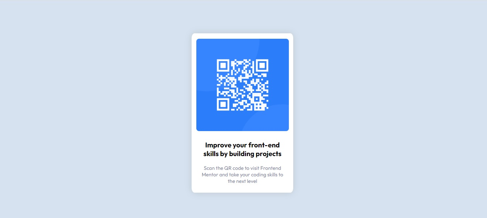

# Frontend Mentor - QR code component solution

This is a solution to the [QR code component challenge on Frontend Mentor](https://www.frontendmentor.io/challenges/qr-code-component-iux_sIO_H). Frontend Mentor challenges help you improve your coding skills by building realistic projects. 

## Table of contents

- [Overview](#overview)
  - [Screenshot](#screenshot)
- [My process](#my-process)
  - [Built with](#built-with)
  - [What I learned](#what-i-learned)
  - [Continued development](#continued-development)
  - [Useful resources](#useful-resources)
- [Author](#author)


## Overview

### Screenshot
Here my solution

Here the design gived from Frontend Mentor


## My process

### Built with

- Semantic HTML5 markup
- CSS custom properties
- Flexbox


### What I learned
Here i learn how to use display-flex
```css
.conteinermain{
    color: black;

    width: 100vw;
    height: 100vh;
    display: flex;
    flex-direction: row;
    justify-content: center;
    align-items: center;
   
    background-color:  hsl(212, 45%, 89%);
}
```
### Continued development

With this challenge i haved learn that i need more practice in the flexbox and in how discover the right size of the conteiners.

### Useful resources

- [Example resource 1](https://www.devmedia.com.br/como-centralizar-divs-em-html-e-css/37568) - This helped me for the flexbox problem reason. I really liked this pattern and will use it going forward.
- [Example resource 2](https://www.w3schools.com/cssref/playdemo.asp?filename=playcss_box-shadow) - This helped helped me finally understand the box-shadow problem.


## Author

- Frontend Mentor - [@SarahPrado](https://www.frontendmentor.io/profile/SarahPrado)
- GitHub - [@SarahPrado](https://github.com/SarahPrado)


